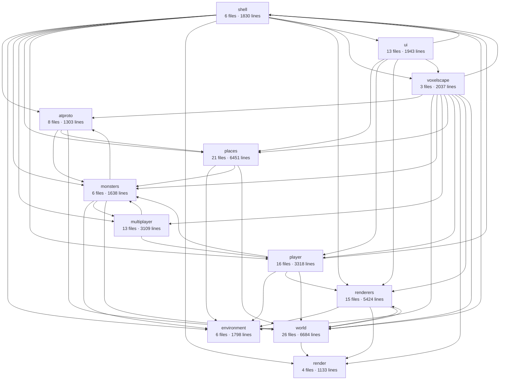

# What voxelscape is made of

Drawn from the imports under `src` at eb15b4b by `pnpm architecture`.
Nothing here is written by hand: change the code and run it again.

## The areas

| area          | what it is for                                                         | files | lines |
| ------------- | ---------------------------------------------------------------------- | ----- | ----- |
| `shell`       | the page, the console, and what wires a world into them                | 6     | 1830  |
| `voxelscape`  | one world: its frame, and every part below it                          | 3     | 2037  |
| `world`       | voxels, light, the streaming window, and the workers that fill it      | 26    | 6684  |
| `renderers`   | turning voxels into geometry, and drawing it                           | 15    | 5424  |
| `render`      | the frame loop, the resolution scaler, and the probe that times them   | 4     | 1133  |
| `player`      | the body, its input, its tools and what they do to the world           | 16    | 3318  |
| `monsters`    | what wanders the world and fights the player                           | 6     | 1638  |
| `multiplayer` | other players, over a peer connection                                  | 13    | 3109  |
| `places`      | a published place: its script, its people, and the sandbox they run in | 21    | 6451  |
| `environment` | the sky, the clock, the weather and the sound                          | 6     | 1798  |
| `atproto`     | being signed in, and reading and writing published records             | 8     | 1303  |
| `ui`          | what is drawn over the world in the page                               | 13    | 1943  |

## What reaches into what

| area          | imports from  | modules doing it |
| ------------- | ------------- | ---------------- |
| `atproto`     | `monsters`    | 1                |
| `atproto`     | `places`      | 1                |
| `atproto`     | `world`       | 2                |
| `monsters`    | `atproto`     | 1                |
| `monsters`    | `environment` | 1                |
| `monsters`    | `multiplayer` | 1                |
| `monsters`    | `world`       | 1                |
| `multiplayer` | `monsters`    | 1                |
| `multiplayer` | `player`      | 1                |
| `places`      | `environment` | 1                |
| `places`      | `monsters`    | 1                |
| `places`      | `world`       | 4                |
| `player`      | `environment` | 1                |
| `player`      | `monsters`    | 2                |
| `player`      | `renderers`   | 1                |
| `player`      | `shell`       | 4                |
| `player`      | `world`       | 7                |
| `renderers`   | `environment` | 1                |
| `renderers`   | `render`      | 2                |
| `renderers`   | `world`       | 7                |
| `shell`       | `atproto`     | 4                |
| `shell`       | `environment` | 2                |
| `shell`       | `monsters`    | 1                |
| `shell`       | `multiplayer` | 2                |
| `shell`       | `places`      | 3                |
| `shell`       | `player`      | 2                |
| `shell`       | `render`      | 2                |
| `shell`       | `renderers`   | 2                |
| `shell`       | `ui`          | 2                |
| `shell`       | `voxelscape`  | 2                |
| `shell`       | `world`       | 3                |
| `ui`          | `places`      | 1                |
| `ui`          | `player`      | 2                |
| `ui`          | `renderers`   | 1                |
| `ui`          | `shell`       | 2                |
| `ui`          | `voxelscape`  | 7                |
| `voxelscape`  | `atproto`     | 1                |
| `voxelscape`  | `environment` | 1                |
| `voxelscape`  | `monsters`    | 1                |
| `voxelscape`  | `multiplayer` | 1                |
| `voxelscape`  | `places`      | 1                |
| `voxelscape`  | `player`      | 1                |
| `voxelscape`  | `render`      | 2                |
| `voxelscape`  | `renderers`   | 1                |
| `voxelscape`  | `shell`       | 1                |
| `voxelscape`  | `world`       | 1                |
| `world`       | `render`      | 2                |
| `world`       | `renderers`   | 5                |

## Areas that reach both ways

- `atproto` and `monsters`
- `monsters` and `multiplayer`
- `player` and `shell`
- `renderers` and `world`
- `shell` and `ui`
- `shell` and `voxelscape`
