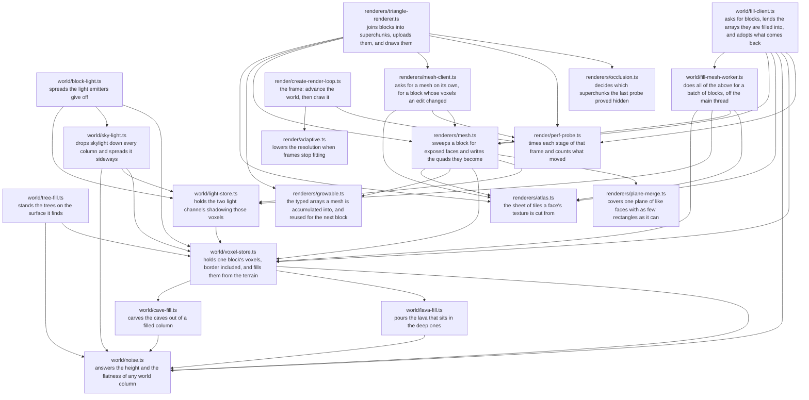

# How a voxel becomes a pixel

Read out of the modules that do it at 42a2f85 by `pnpm rendering`.
Every number below is the one the code declares, not a note about it.

## The path

An arrow is an import, so it points from a module to one it reads —
which is the reverse of the way the data flows.

## What a block is

|                      |                                                         |
| -------------------- | ------------------------------------------------------- |
| voxels a block       | 64³                                                     |
| world units a voxel  | 2                                                       |
| world units a block  | 128³                                                    |
| border voxels a face | 1, so a block's arrays are 66³ = 287,496 long           |
| bytes a block holds  | 862,488: voxels, skylight and blocklight, one byte each |
| blocks a superchunk  | 2³, which is 256 world units a side                     |

## What a vertex carries

| attribute    | numbers | bytes  |
| ------------ | ------- | ------ |
| `position`   | 3       | 12     |
| `normal`     | 3       | 12     |
| `uv`         | 2       | 8      |
| `tileIndex`  | 1       | 4      |
| `brightness` | 1       | 4      |
| **total**    |         | **40** |

`VERTEX_UPLOAD_BYTES` says 40, which is what the frame's upload budget
spends against. An index costs 4 bytes on top, six to a quad.

## The frame, in the order it is timed

1. `player`
2. `scroll`
3. `flow`
4. `multiplayer`
5. `monsters`
6. `environment`
7. `meshDrain`
8. `merge`
9. `rendererTick`
10. `advance`
11. `occlusion`
12. `draw`

`advance` holds every stage above it except the last two: what the probe
reports as advance is the world's whole update, and `occlusion` and `draw`
are the drawing that follows it.

## What the workers say to each other

| message    | declared in                 |
| ---------- | --------------------------- |
| `config`   | `world/fill-worker.ts`      |
| `fill`     | `world/fill-worker.ts`      |
| `fillMesh` | `world/fill-mesh-worker.ts` |
| `mesh`     | `renderers/mesh.ts`         |

## The numbers that govern it

| constant                     | value                                | where                            | what it is for                                                                                                                                           |
| ---------------------------- | ------------------------------------ | -------------------------------- | -------------------------------------------------------------------------------------------------------------------------------------------------------- |
| `VOXEL_SIZE`                 | `2`                                  | `world/level-data.ts`            | World units per voxel at LOD 0; each higher LOD doubles this value.                                                                                      |
| `CHUNK_VOXELS`               | `64`                                 | `world/level-data.ts`            | The number of voxels per axis in a `WorldBlock`, the chunk the sphere streams.                                                                           |
| `VOXEL_PADDING`              | `1`                                  | `world/voxel-store.ts`           | How many rows of extra voxels each block stores beyond its interior volume, on all six faces.                                                            |
| `MAX_WORKERS`                | `4`                                  | `world/worker-pool.ts`           | How many world workers one pool runs at most.                                                                                                            |
| `MAX_FILLS_PER_WORKER`       | `4`                                  | `world/fill-client.ts`           | How a drain distributes the workload: one batch per worker at a time, of at most this many slots.                                                        |
| `MAX_SPARE_SETS`             | `MAX_FILLS_PER_WORKER * MAX_WORKERS` | `world/fill-client.ts`           | Sets of a block's three arrays kept to lend to the next fill, per array length.                                                                          |
| `SUPERCHUNK_SPAN`            | `2`                                  | `renderers/triangle-renderer.ts` | Chunk cells per superchunk per axis: 2 chunks of 64³ voxels, 256³ world units.                                                                           |
| `MAX_UPLOAD_STALL_FRAMES`    | `6`                                  | `renderers/triangle-renderer.ts` | Frames a superchunk may keep gaining members before a partial upload is forced.                                                                          |
| `MAX_UPLOAD_BYTES_PER_FRAME` | `2 * 1024 * 1024`                    | `renderers/triangle-renderer.ts` | The bytes of merged geometry one frame may mark for GPU upload.                                                                                          |
| `GEOMETRY_POOL_FRAMES`       | `8`                                  | `renderers/triangle-renderer.ts` | Frames' worth of upload the recycled geometry pool holds.                                                                                                |
| `VERTEX_UPLOAD_BYTES`        | `40`                                 | `renderers/triangle-renderer.ts` | The bytes one vertex of merged geometry adds to the GPU upload: position 12 + normal 12 + uv 8 + the tile it repeats 4 + brightness 4.                   |
| `INDEX_UPLOAD_BYTES`         | `4`                                  | `renderers/triangle-renderer.ts` | The bytes one index of merged geometry adds to the GPU upload.                                                                                           |
| `DEFAULT_OCCLUSION_INTERVAL` | `200`                                | `renderers/triangle-renderer.ts` | Frames between the hardware occlusion queries, each a readback that stalls the pipeline.                                                                 |
| `MAX_BUILDS_PER_DRAIN`       | `12`                                 | `renderers/mesh-client.ts`       | How many block meshes to hand the workers per drain, in total; the workers do the heavy lifting, so the main thread only pays for wrapping the requests. |
